---
**Title:** Task WebApp Frontend - Architecture Overview  
**Description:** System design, C4 diagrams, component architecture, data flow, and technology stack  
**Last Updated:** October 2, 2025  
**Status:** Production Ready
---

# Architecture Overview

## Table of Contents

- [System Context](#system-context)
- [Container Architecture](#container-architecture)
- [Component Architecture](#component-architecture)
- [Data Flow](#data-flow)
- [State Management](#state-management)
- [Feature-Based Architecture](#feature-based-architecture)
- [Technology Stack](#technology-stack)
- [Design Patterns](#design-patterns)
- [Security Architecture](#security-architecture)
- [Performance Architecture](#performance-architecture)
- [See Also](#see-also)

---

## System Context

### C4 Model - Level 1: System Context Diagram

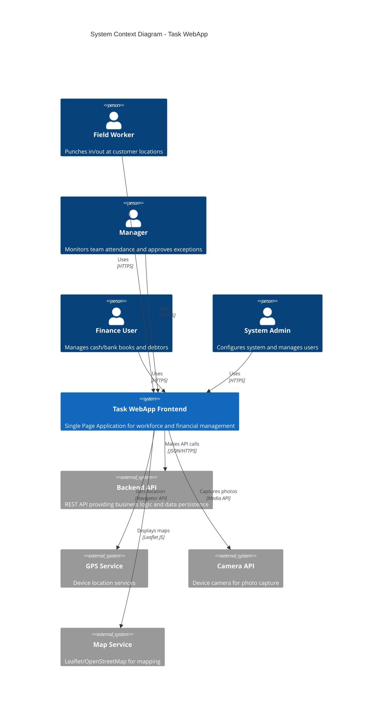

---

## Container Architecture

### C4 Model - Level 2: Container Diagram

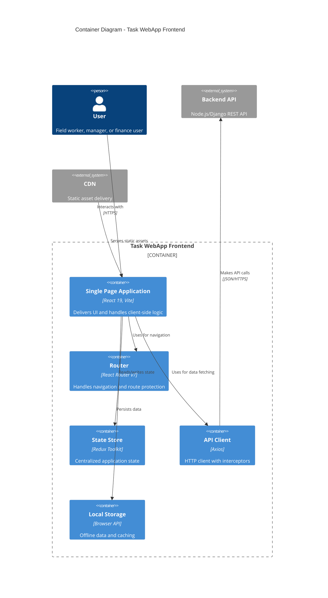

### Application Layers

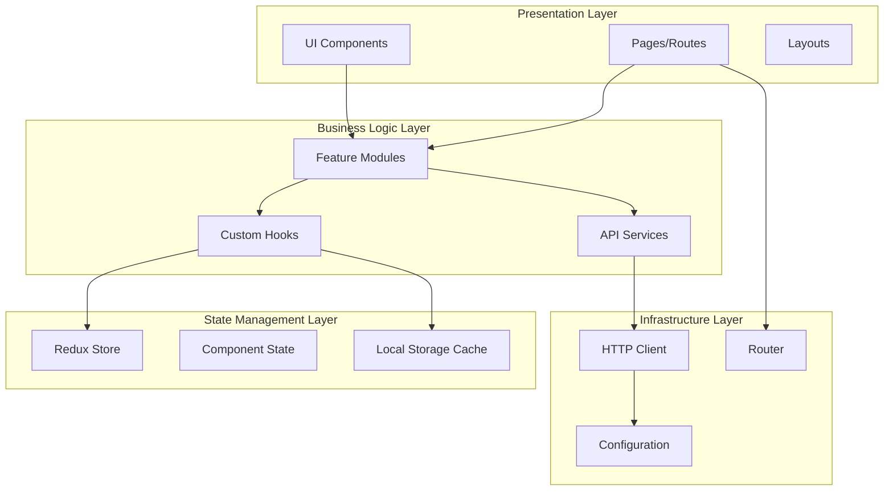

---

## Component Architecture

### C4 Model - Level 3: Component Diagram (Punch-In Feature)

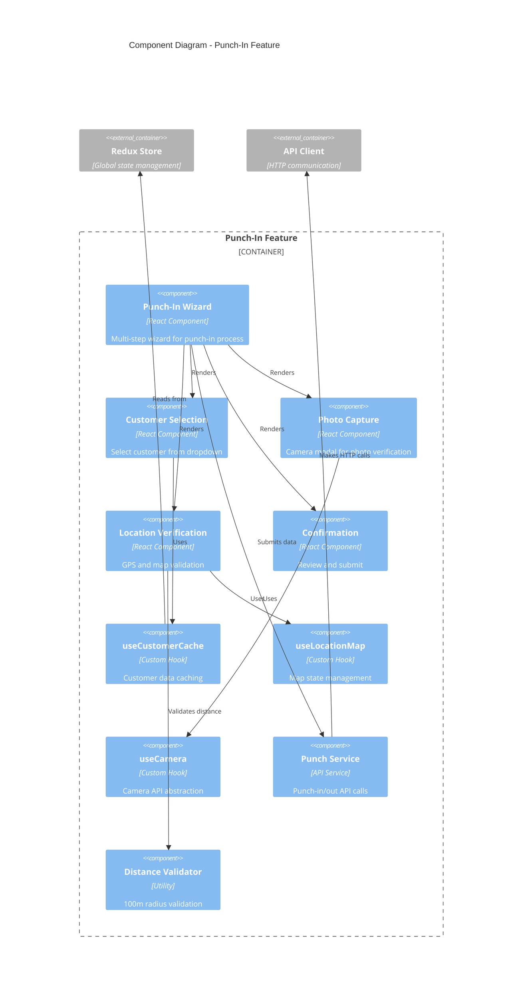

### Feature Module Structure

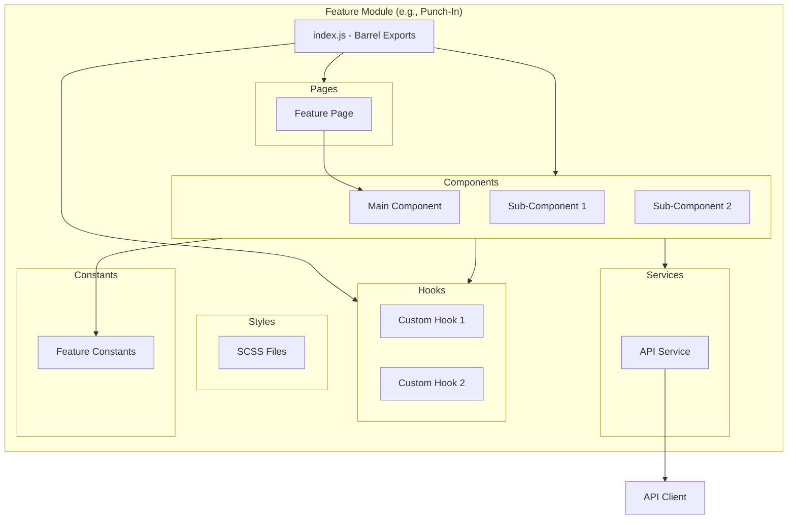

---

## Data Flow

### Authentication Flow

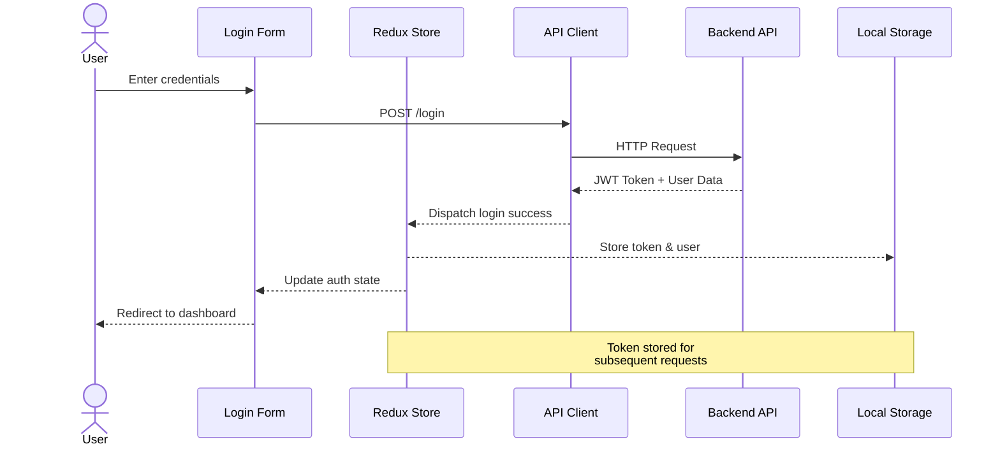

### Punch-In Flow

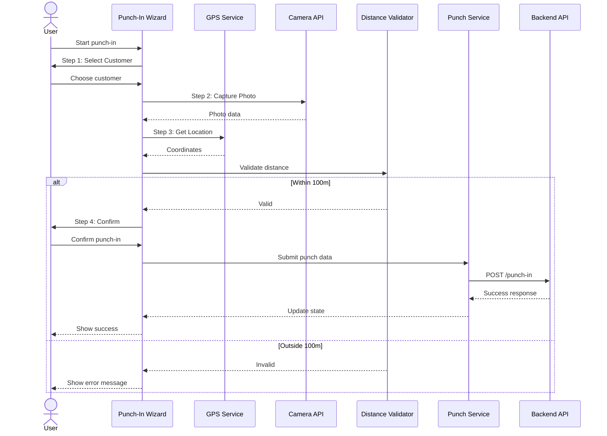

### Data Fetch & Cache Flow

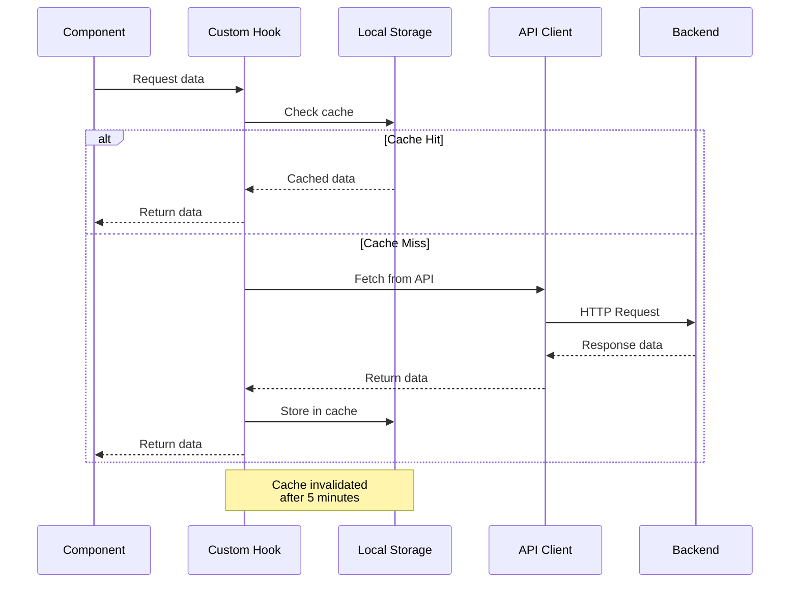

---

## State Management

### Redux Store Architecture

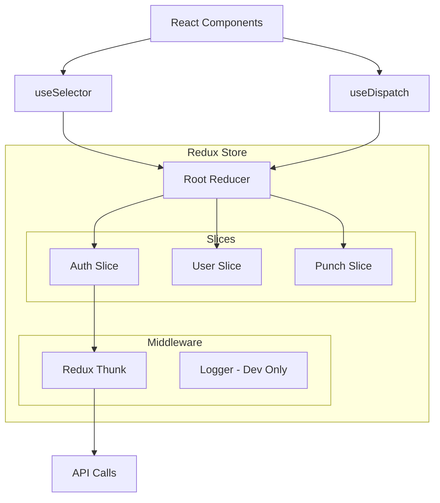

### State Hierarchy

```typescript
// Global State Structure
{
  auth: {
    user: {
      client_id: string,
      username: string,
      role: 'admin' | 'user',
      accountcode: string
    },
    token: string,
    isAuthenticated: boolean,
    loading: boolean,
    error: string | null
  },
  // Feature states managed in components
}
```

### State Management Strategy

| State Type | Solution | Use Case |
|------------|----------|----------|
| **Global Auth** | Redux | User session, token |
| **Feature State** | Component State | UI state, form data |
| **Server Cache** | Custom Hooks | API responses, customer lists |
| **UI State** | Local State | Modals, dropdowns, toggles |
| **Persistent** | Local Storage | Offline data, preferences |

---

## Feature-Based Architecture

### Directory Structure

```
src/
├── app/                    # Application shell
│   ├── App.jsx            # Routing & layout
│   ├── AppProviders.jsx   # Providers wrapper
│   └── config.js          # Environment config
│
├── features/              # Self-contained features
│   ├── auth/              # Authentication
│   │   ├── components/    # Login form, protected routes
│   │   ├── pages/         # Login page
│   │   ├── store/         # Auth slice
│   │   ├── styles/        # Auth styles
│   │   └── index.js       # Barrel exports
│   │
│   ├── punchin/           # Punch-in/out
│   │   ├── components/    # Wizard, steps, camera
│   │   ├── hooks/         # Custom hooks
│   │   ├── pages/         # Punch pages
│   │   ├── services/      # Punch API
│   │   ├── styles/        # Punch styles
│   │   └── index.js
│   │
│   ├── finance/           # Financial management
│   └── dashboard/         # Dashboards
│
├── components/            # Shared components
│   ├── layout/            # Navbar, footer
│   └── ui/                # Buttons, modals, tables
│
├── services/              # Core services
│   ├── apiClient.js       # Axios instance
│   └── index.js
│
├── hooks/                 # Global custom hooks
├── utils/                 # Utility functions
├── constants/             # App constants
└── store/                 # Redux configuration
```

### Feature Module Pattern

Each feature is **self-contained** and follows this structure:

```
feature-name/
├── components/            # Feature-specific components
│   ├── FeatureMain.jsx
│   └── SubComponent.jsx
├── hooks/                 # Feature-specific hooks
│   └── useFeatureLogic.js
├── pages/                 # Feature pages
│   └── FeaturePage.jsx
├── services/              # Feature API calls
│   └── featureService.js
├── styles/                # Feature styles
│   └── feature.scss
├── constants/             # Feature constants
│   └── constants.js
└── index.js              # Barrel exports
```

**Benefits:**
- ✅ Easy to locate and modify feature code
- ✅ Clear boundaries and dependencies
- ✅ Facilitates code splitting and lazy loading
- ✅ Enables feature flags and A/B testing
- ✅ Simplifies testing and maintenance

---

## Technology Stack

### Frontend Technologies

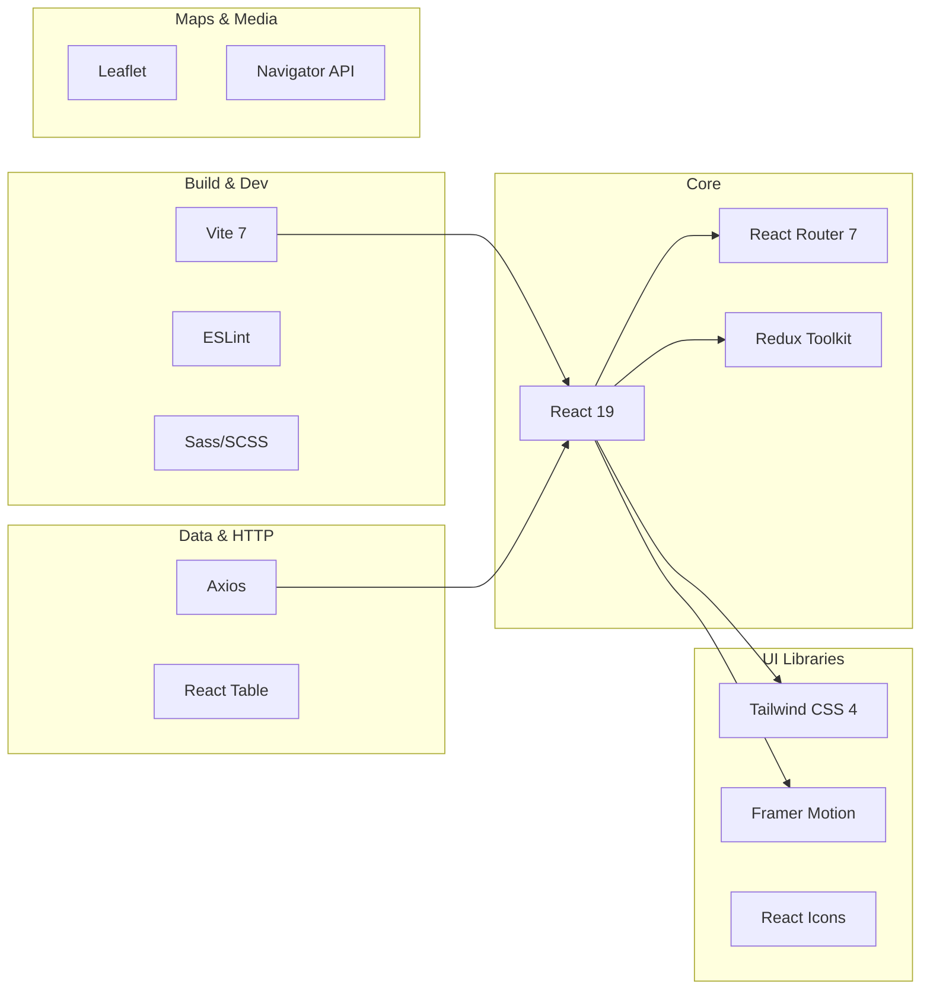

### Technology Decisions

| Technology | Version | Reason |
|------------|---------|--------|
| **React** | 19 RC | Server Components, improved performance, better DX |
| **Vite** | 7.0 | 10-100x faster builds, HMR, ESM-native |
| **Redux Toolkit** | 2.8 | Simplified Redux, built-in best practices |
| **React Router** | 7.7 | Data loading, nested routes, code splitting |
| **Axios** | 1.11 | Interceptors, request cancellation, TypeScript support |
| **Leaflet** | 1.9 | No API key, lightweight, open source |
| **SCSS** | 1.89 | Variables, mixins, nesting |
| **Tailwind** | 4.1 | Utility-first, rapid prototyping, purged builds |
| **Framer Motion** | 12.23 | Declarative animations, great DX |

---

## Design Patterns

### 1. Container-Presentational Pattern

```jsx
// Container (Smart Component)
const CustomerSelectionContainer = () => {
  const { customers, loading, error } = useCustomerCache();
  const [selected, setSelected] = useState(null);

  return (
    <CustomerSelectionPresenter
      customers={customers}
      loading={loading}
      error={error}
      selected={selected}
      onSelect={setSelected}
    />
  );
};

// Presenter (Dumb Component)
const CustomerSelectionPresenter = ({
  customers,
  loading,
  selected,
  onSelect
}) => {
  if (loading) return <Spinner />;
  
  return (
    <select value={selected} onChange={(e) => onSelect(e.target.value)}>
      {customers.map(c => (
        <option key={c.id} value={c.id}>{c.name}</option>
      ))}
    </select>
  );
};
```

### 2. Custom Hooks Pattern

```jsx
// Encapsulate complex logic in custom hooks
const useGeolocation = () => {
  const [location, setLocation] = useState(null);
  const [error, setError] = useState(null);
  const [loading, setLoading] = useState(false);

  const fetchLocation = useCallback(() => {
    setLoading(true);
    navigator.geolocation.getCurrentPosition(
      (position) => {
        setLocation({
          latitude: position.coords.latitude,
          longitude: position.coords.longitude
        });
        setLoading(false);
      },
      (err) => {
        setError(err.message);
        setLoading(false);
      }
    );
  }, []);

  return { location, error, loading, fetchLocation };
};
```

### 3. Service Layer Pattern

```jsx
// Centralize API calls in service modules
// src/features/punchin/services/punchService.js
import apiClient from '../../../services/apiClient';

export const PunchAPI = {
  async punchIn(data) {
    return apiClient.post('/punch-in', data);
  },
  
  async punchOut(punchId) {
    return apiClient.post(`/punch-out/${punchId}`);
  },
  
  async getActivePunch() {
    return apiClient.get('/punch-in/active');
  }
};
```

### 4. Composition Pattern

```jsx
// Build complex UIs from simple components
const Wizard = ({ steps, currentStep, onNext, onPrev }) => (
  <div className="wizard">
    <WizardProgress steps={steps} current={currentStep} />
    <WizardContent>{steps[currentStep].component}</WizardContent>
    <WizardActions onNext={onNext} onPrev={onPrev} />
  </div>
);
```

---

## Security Architecture

### Authentication & Authorization

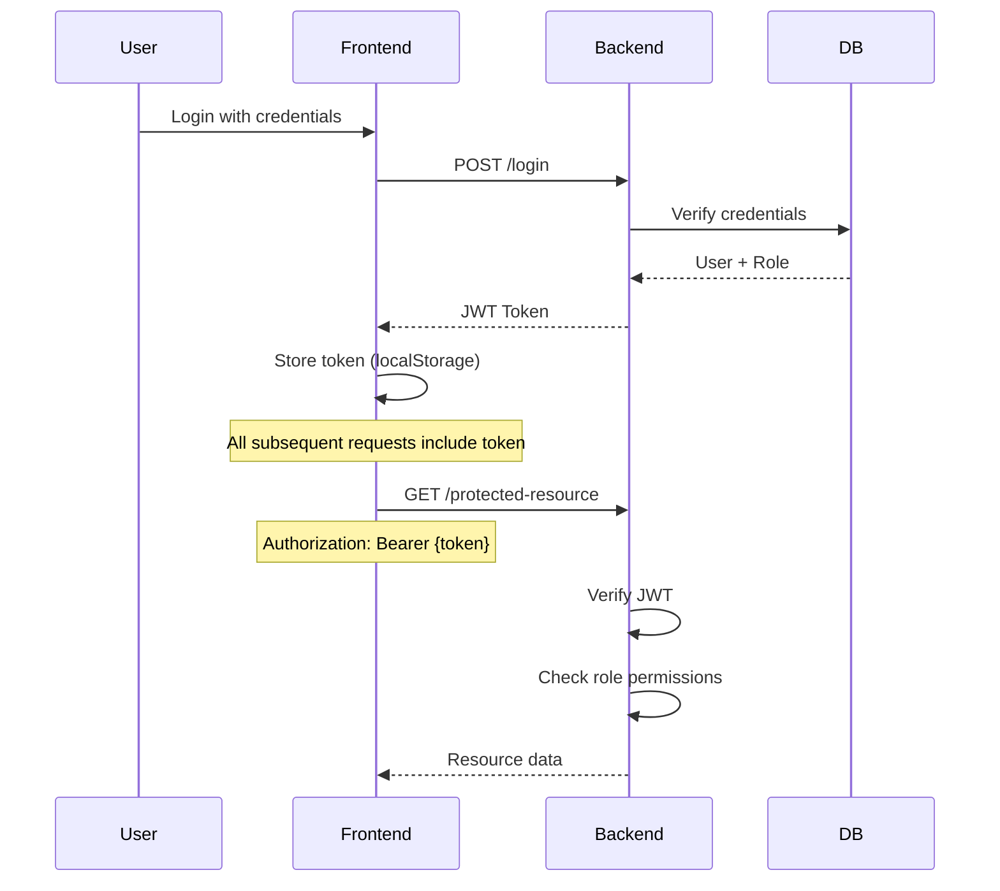

### Security Layers

1. **Client-Side Protection**
   - Route guards (ProtectedRoute)
   - Role-based rendering
   - Input validation
   - XSS prevention (React escaping)

2. **HTTP Security**
   - JWT tokens in Authorization header
   - HTTPS only in production
   - CORS configuration
   - Request/response interceptors

3. **Data Security**
   - Sensitive data not in localStorage
   - Token expiration handling
   - Automatic logout on 401
   - No credentials in URL params

---

## Performance Architecture

### Code Splitting Strategy

```jsx
// Route-based code splitting
const DashboardAdmin = lazy(() => import('./features/dashboard/pages/Dashboard_admin'));
const PunchInCapture = lazy(() => import('./features/punchin/pages/PunchInCapture'));

// Lazy load with Suspense
<Suspense fallback={<LoadingSpinner />}>
  <Routes>
    <Route path="/dashboard/admin" element={<DashboardAdmin />} />
    <Route path="/punch-in/capture" element={<PunchInCapture />} />
  </Routes>
</Suspense>
```

### Performance Optimization Techniques

| Technique | Implementation | Impact |
|-----------|----------------|--------|
| **Code Splitting** | React.lazy + Suspense | -60% initial bundle |
| **Tree Shaking** | ES6 imports | -20% bundle size |
| **Image Optimization** | WebP, lazy loading | -40% image size |
| **Memoization** | React.memo, useMemo | -30% re-renders |
| **Debouncing** | Custom debounce hook | -70% API calls |
| **Virtual Scrolling** | React Table virtualization | Handles 10K+ rows |
| **Service Worker** | Workbox | Offline capability |

### Bundle Analysis

```
Initial Bundle:
├── vendor.js      180 KB (React, Redux, Router)
├── app.js         120 KB (Core app code)
├── features/      200 KB (Lazy-loaded features)
└── styles.css      45 KB (Purged Tailwind + SCSS)
─────────────────────────────
Total:             545 KB (gzipped: 180 KB)
```

---

## See Also

- [Introduction](./introduction.md) - Project overview and objectives
- [Development Guide](./development.md) - Local development setup
- [API Reference](./api-reference.md) - Backend API documentation
- [Performance Guide](./performance.md) - Optimization strategies
- [Security Guide](./security.md) - Security best practices
