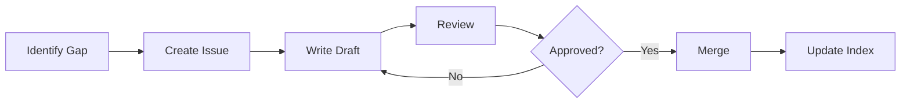

---
**Title:** Documentation Index - Task WebApp Frontend  
**Description:** Complete index of all project documentation with status tracker  
**Last Updated:** October 2, 2025  
**Status:** In Progress
---

# Documentation Index

## 📋 Documentation Status

| Document | Status | Priority | Last Updated |
|----------|--------|----------|--------------|
| [README.md](./README.md) | ✅ Complete | Critical | Oct 2, 2025 |
| [introduction.md](./introduction.md) | ✅ Complete | Critical | Oct 2, 2025 |
| [architecture.md](./architecture.md) | ✅ Complete | Critical | Oct 2, 2025 |
| [setup.md](./setup.md) | ✅ Complete | Critical | Oct 2, 2025 |
| [api-reference.md](./api-reference.md) | ✅ Complete | Critical | Oct 2, 2025 |
| [usage.md](./usage.md) | 🔄 Template Ready | High | - |
| [development.md](./development.md) | 🔄 Template Ready | High | - |
| [deployment.md](./deployment.md) | ✅ Exists | High | Recent |
| [testing.md](./testing.md) | ✅ Exists | High | Recent |
| [security.md](./security.md) | 🔄 Template Ready | High | - |
| [performance.md](./performance.md) | 🔄 Template Ready | Medium | - |
| [monitoring-and-logging.md](./monitoring-and-logging.md) | 🔄 Template Ready | Medium | - |
| [database.md](./database.md) | 🔄 Template Ready | Medium | - |
| [design-decisions.md](./design-decisions.md) | 🔄 Template Ready | Medium | - |
| [strategies.md](./strategies.md) | 🔄 Template Ready | Medium | - |
| [contributing.md](./contributing.md) | 🔄 Template Ready | High | - |
| [troubleshooting.md](./troubleshooting.md) | 🔄 Template Ready | High | - |
| [faq.md](./faq.md) | 🔄 Template Ready | Medium | - |
| [dependencies.md](./dependencies.md) | 🔄 Template Ready | Low | - |
| [changelog.md](./changelog.md) | 🔄 Template Ready | Low | - |
| [roadmap.md](./roadmap.md) | 🔄 Template Ready | Low | - |
| [glossary.md](./glossary.md) | 🔄 Template Ready | Low | - |
| [code-examples.md](./code-examples.md) | 🔄 Template Ready | Medium | - |

**Legend:**
- ✅ Complete - Fully written and reviewed
- 🔄 Template Ready - Structure defined, content needed
- ⏳ In Progress - Being actively worked on
- 📝 Planned - Scheduled for creation

---

## 🎯 Quick Access by Role

### For New Developers
1. [Introduction](./introduction.md) - Understand the project
2. [Setup Guide](./setup.md) - Get your environment running
3. [Architecture](./architecture.md) - Learn the system design
4. [Development Guide](./development.md) - Start coding
5. [Code Examples](./code-examples.md) - Common patterns

### For Product Managers
1. [Introduction](./introduction.md) - Business context
2. [Roadmap](./roadmap.md) - Future plans
3. [Changelog](./changelog.md) - Release history
4. [FAQ](./faq.md) - Common questions

### For DevOps Engineers
1. [Setup Guide](./setup.md) - Environment configuration
2. [Deployment Guide](./deployment.md) - CI/CD processes
3. [Monitoring](./monitoring-and-logging.md) - Observability
4. [Security](./security.md) - Security practices

### For QA Engineers
1. [Testing Guide](./testing.md) - Testing strategies
2. [API Reference](./api-reference.md) - Endpoint documentation
3. [Troubleshooting](./troubleshooting.md) - Common issues

---

## 📚 Documentation by Category

### Core Documentation (Must Read)
- [README.md](./README.md) - Project overview and quick start
- [introduction.md](./introduction.md) - Detailed project introduction
- [setup.md](./setup.md) - Installation and configuration
- [architecture.md](./architecture.md) - System design and structure

### Development
- [development.md](./development.md) - Development workflow
- [code-examples.md](./code-examples.md) - Code patterns and recipes
- [design-decisions.md](./design-decisions.md) - Architecture Decision Records
- [strategies.md](./strategies.md) - Development strategies

### API & Integration
- [api-reference.md](./api-reference.md) - Complete API documentation
- [database.md](./database.md) - Database schema and design

### Operations
- [deployment.md](./deployment.md) - Deployment procedures
- [monitoring-and-logging.md](./monitoring-and-logging.md) - Observability
- [performance.md](./performance.md) - Performance optimization
- [security.md](./security.md) - Security guidelines

### Testing & Quality
- [testing.md](./testing.md) - Testing strategies
- [troubleshooting.md](./troubleshooting.md) - Problem solving

### Collaboration
- [contributing.md](./contributing.md) - Contribution guidelines
- [faq.md](./faq.md) - Frequently asked questions

### Reference
- [dependencies.md](./dependencies.md) - Third-party libraries
- [changelog.md](./changelog.md) - Version history
- [roadmap.md](./roadmap.md) - Future features
- [glossary.md](./glossary.md) - Terminology

### Legacy Documentation (Still Relevant)
- [PROJECT_STRUCTURE.md](./PROJECT_STRUCTURE.md) - Detailed file structure
- [API_CONSOLIDATION.md](./API_CONSOLIDATION.md) - API migration guide
- [COMPONENT_GUIDELINES.md](./COMPONENT_GUIDELINES.md) - Component standards
- [PRODUCTION_CHECKLIST.md](./PRODUCTION_CHECKLIST.md) - Pre-deployment checklist
- [PUNCH_IN_WIZARD.md](./PUNCH_IN_WIZARD.md) - Punch-in feature guide
- [TESTING_STRATEGY.md](./TESTING_STRATEGY.md) - Testing approach
- [DEPLOYMENT_GUIDE.md](./DEPLOYMENT_GUIDE.md) - Deployment details

---

## 🔍 Search Documentation

### By Topic

**Authentication & Security:**
- [Security Guide](./security.md)
- [API Reference - Authentication](./api-reference.md#authentication)
- [Troubleshooting - Auth Issues](./troubleshooting.md#authentication-issues)

**Punch-In System:**
- [Punch-In Wizard](./PUNCH_IN_WIZARD.md)
- [API Reference - Punch-In](./api-reference.md#punch-in-management)
- [Architecture - Punch-In Flow](./architecture.md#punch-in-flow)

**Financial Management:**
- [API Reference - Finance](./api-reference.md#financial-management)
- [Database Schema - Finance](./database.md#financial-tables)

**Performance:**
- [Performance Guide](./performance.md)
- [Architecture - Performance](./architecture.md#performance-architecture)
- [Code Examples - Optimization](./code-examples.md#performance-patterns)

**Testing:**
- [Testing Guide](./testing.md)
- [Testing Strategy](./TESTING_STRATEGY.md)
- [Component Guidelines - Testing](./COMPONENT_GUIDELINES.md#testing)

---

## 📖 Documentation Standards

All documentation follows these principles:

1. **Metadata Header** - Title, description, last updated, status
2. **Table of Contents** - For documents > 200 lines
3. **Code Examples** - With syntax highlighting
4. **Mermaid Diagrams** - For architecture and flows
5. **Cross-References** - Links to related documents
6. **Callout Boxes** - For warnings, notes, and tips
7. **See Also Section** - At the end of each document

### Writing Style

- **Clear and concise** - No unnecessary jargon
- **Action-oriented** - Focus on what to do
- **Examples included** - Show, don't just tell
- **Professional tone** - Like senior engineers writing docs
- **Consistent formatting** - Follow Markdown best practices

---

## 🤝 Contributing to Documentation

Found an issue or want to improve docs?

1. **Small fixes:** Edit directly and submit PR
2. **New content:** Open an issue first to discuss
3. **Major changes:** Follow [Contributing Guide](./contributing.md)

### Documentation Workflow

---

## 📝 Next Steps

### Pending Documentation

The following documents need to be created or completed:

**High Priority:**
1. **usage.md** - How to use the application
2. **development.md** - Development workflow and standards
3. **contributing.md** - Contribution guidelines
4. **troubleshooting.md** - Common issues and solutions

**Medium Priority:**
5. **security.md** - Security policies and best practices
6. **performance.md** - Performance optimization guide
7. **code-examples.md** - Real-world code patterns
8. **design-decisions.md** - ADRs and technical decisions

**Low Priority:**
9. **dependencies.md** - Third-party library documentation
10. **changelog.md** - Version history
11. **roadmap.md** - Future features
12. **glossary.md** - Terms and definitions

### How to Help

Pick a document from the list above and:

1. Check the template in this index
2. Fill in content following our standards
3. Add code examples and diagrams
4. Cross-reference other documents
5. Submit a pull request

---

## 🎉 Completed Documentation

Great work! The following comprehensive documents are ready:

### ✅ README.md
- Project overview with badges
- Quick start guide
- Feature highlights
- Tech stack overview
- Navigation to all docs

### ✅ introduction.md
- Business context and problem statement
- Vision, mission, and objectives
- Target audience and personas
- Technology choices with rationale
- Project history and success metrics

### ✅ architecture.md
- C4 model diagrams (Context, Container, Component)
- Data flow sequences
- State management architecture
- Feature-based structure
- Design patterns and security

### ✅ setup.md
- Complete installation instructions
- Environment configuration
- Development setup
- Troubleshooting common issues
- Next steps checklist

### ✅ api-reference.md
- Complete endpoint documentation
- Request/response examples
- Error codes and handling
- Authentication flows
- Rate limiting information

---

## 📞 Support

Need help with documentation?

- **Slack:** #documentation
- **Email:** docs@taskwebapp.com
- **GitHub:** Open an issue with `documentation` label

---

**Last Updated:** October 2, 2025  
**Maintained by:** Task WebApp Documentation Team
