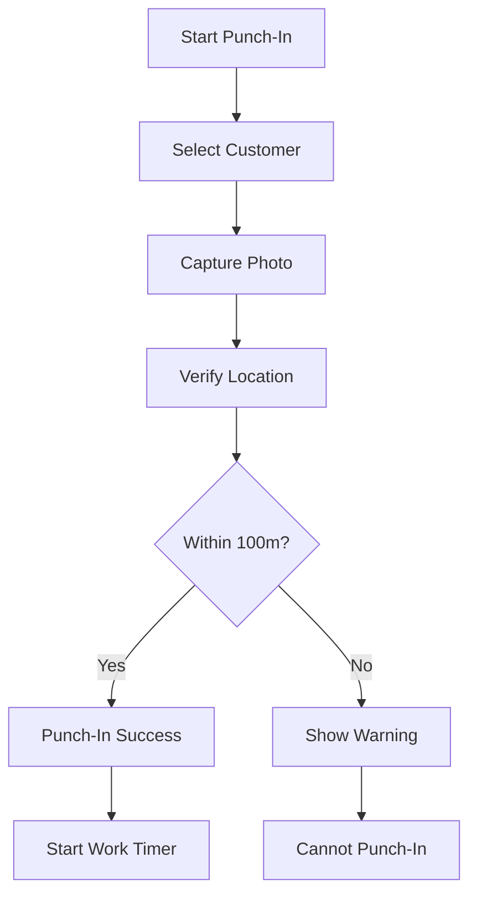

---
**Title:** Task WebApp Frontend - Introduction  
**Description:** Project overview, problem statement, vision, objectives, and target audience  
**Last Updated:** October 2, 2025  
**Status:** Production Ready
---

# Introduction

## Table of Contents

- [Project Overview](#project-overview)
- [Problem Statement](#problem-statement)
- [Vision & Mission](#vision--mission)
- [Project Objectives](#project-objectives)
- [Target Audience](#target-audience)
- [Key Features](#key-features)
- [Technology Choices](#technology-choices)
- [Project History](#project-history)
- [See Also](#see-also)

---

## Project Overview

**Task WebApp Frontend** is a comprehensive business management platform designed for field operations, financial tracking, and location-based workforce management. Built with modern web technologies, it provides real-time location validation, automated time tracking, and financial management capabilities for organizations with distributed teams.

### Core Capabilities

The application consists of four primary modules:

1. **Authentication & Authorization** - Role-based access control (Admin/User)
2. **Punch-In System** - Location-validated attendance with photo verification
3. **Financial Management** - Cash book, bank book, and debtor tracking
4. **Dashboard & Analytics** - Real-time insights and operational metrics

---

## Problem Statement

### Business Challenges

Organizations with field-based operations face several critical challenges:

#### 1. **Attendance Verification**
- Traditional time-tracking systems lack location verification
- No proof of physical presence at work locations
- Manual entry leads to inaccuracies and fraud
- Difficult to enforce proximity requirements

#### 2. **Financial Tracking**
- Fragmented financial data across multiple tools
- No real-time visibility into cash flow
- Manual reconciliation is time-consuming and error-prone
- Difficult to track debtors and outstanding payments

#### 3. **Operational Overhead**
- Managers spend excessive time on administrative tasks
- Lack of audit trails for compliance
- No centralized system for workforce management
- Poor mobile accessibility for field workers

### Technical Challenges

- Need for offline-first architecture for unreliable connectivity
- Real-time location validation without compromising privacy
- Secure authentication across multiple devices
- Responsive design for various screen sizes and devices

---

## Vision & Mission

### Vision

**To be the leading platform for distributed workforce management, combining location intelligence with financial transparency to empower organizations of all sizes.**

### Mission

**Build an intuitive, secure, and reliable platform that:**
- Automates attendance tracking with location validation
- Provides real-time financial visibility
- Reduces administrative overhead by 70%
- Ensures compliance through comprehensive audit trails
- Works seamlessly in both online and offline scenarios

---

## Project Objectives

### Primary Objectives

#### 1. **Accurate Time & Attendance**
- ✅ Implement GPS-based location validation (100m radius)
- ✅ Capture photo verification during punch-in
- ✅ Real-time tracking of work hours
- ✅ Automatic calculation of overtime and breaks

#### 2. **Financial Transparency**
- ✅ Real-time cash and bank book management
- ✅ Automated debtor tracking with aging reports
- ✅ Multi-user access with role-based permissions
- ✅ Export capabilities for accounting systems

#### 3. **User Experience**
- ✅ Mobile-first responsive design
- ✅ Offline functionality with sync capabilities
- ✅ Intuitive wizard-based workflows
- ✅ Real-time feedback and error handling

#### 4. **Security & Compliance**
- ✅ JWT-based authentication
- ✅ Role-based access control (RBAC)
- ✅ Audit logs for all critical operations
- ✅ Data encryption in transit and at rest

### Secondary Objectives

- 🔄 Real-time notifications and alerts
- 🔄 Advanced analytics and reporting
- 🔄 Integration with third-party payroll systems
- 🔄 Multi-language support

> **Note:** ✅ = Completed, 🔄 = In Progress, 📅 = Planned

---

## Target Audience

### Primary Users

#### 1. **Field Workers**
- **Needs:** Simple punch-in/out, mobile accessibility, offline capability
- **Pain Points:** Complex UIs, poor mobile experience, connectivity issues
- **Solution:** Mobile-first wizard, offline-first architecture, one-tap actions

#### 2. **Managers/Supervisors**
- **Needs:** Real-time visibility, team analytics, location verification
- **Pain Points:** Manual verification, data fragmentation, compliance tracking
- **Solution:** Admin dashboard, real-time alerts, audit trails

#### 3. **Finance Teams**
- **Needs:** Accurate financial data, reconciliation tools, reporting
- **Pain Points:** Manual data entry, reconciliation errors, delayed insights
- **Solution:** Automated tracking, real-time updates, export capabilities

#### 4. **System Administrators**
- **Needs:** User management, system configuration, security controls
- **Pain Points:** Complex setup, security vulnerabilities, maintenance overhead
- **Solution:** Role-based controls, centralized config, automated updates

### User Personas

#### Persona 1: Rajesh - Field Sales Representative
- **Age:** 28
- **Tech Savvy:** Medium
- **Usage:** Daily punch-in at customer locations
- **Goals:** Quick check-in, proof of visit, expense tracking
- **Frustrations:** Slow apps, connectivity issues, complex forms

#### Persona 2: Priya - Operations Manager
- **Age:** 35
- **Tech Savvy:** High
- **Usage:** Monitor team attendance, verify locations, approve exceptions
- **Goals:** Real-time visibility, compliance assurance, efficiency
- **Frustrations:** Data silos, manual verification, reporting overhead

#### Persona 3: Arun - Finance Controller
- **Age:** 42
- **Tech Savvy:** Medium
- **Usage:** Daily financial tracking, month-end reconciliation
- **Goals:** Accurate records, automated reconciliation, audit trails
- **Frustrations:** Manual entry, errors, delayed reporting

---

## Key Features

### Punch-In System

**Features:**
- 📍 GPS-based location validation (100m radius)
- 📸 Mandatory photo verification
- 🧭 Interactive map with customer locations
- ⚡ Auto-location detection
- 💾 Offline capability with sync
- 🔄 Real-time status updates

### Financial Management

**Cash Book:**
- Daily cash transactions
- Balance tracking
- Category-wise reporting
- Export to Excel/PDF

**Bank Book:**
- Multi-bank account support
- Transaction reconciliation
- Statement imports
- Balance alerts

**Debtors:**
- Customer-wise outstanding
- Aging analysis (30/60/90 days)
- Payment reminders
- Collection tracking

### Dashboard & Analytics

- 📊 Real-time attendance metrics
- 💰 Financial summaries
- 📈 Trend analysis
- 🎯 Goal tracking
- 📱 Mobile-optimized widgets

---

## Technology Choices

### Frontend Stack

| Technology | Version | Rationale |
|------------|---------|-----------|
| React | 19 RC | Latest features, performance improvements |
| Redux Toolkit | 2.8 | Simplified state management |
| React Router | 7.7 | Advanced routing, data loading |
| Vite | 7.0 | Fast builds, HMR, optimized bundles |
| SCSS | 1.89 | Powerful styling with variables and mixins |
| Tailwind CSS | 4.1 | Utility-first, rapid prototyping |

### Key Libraries

- **Axios** - HTTP client with interceptors
- **Leaflet** - Interactive maps without API keys
- **Framer Motion** - Smooth animations
- **React Table** - Powerful data tables
- **React Toastify** - User notifications
- **React Icons** - Comprehensive icon library

### Development Tools

- **ESLint** - Code quality and consistency
- **Sass** - CSS preprocessing
- **Git** - Version control
- **GitHub Actions** - CI/CD automation

### Why These Choices?

#### React 19
- Server Components for better performance
- Automatic batching for fewer renders
- Improved hydration and streaming
- Better TypeScript support

#### Vite over Create React App
- 10-100x faster cold starts
- Lightning-fast HMR
- Optimized production builds
- Native ES modules support

#### Redux Toolkit over Context API
- Better DevTools integration
- Middleware support (thunk, saga)
- Time-travel debugging
- Normalized state patterns

#### Leaflet over Google Maps
- No API key required
- Open source, no vendor lock-in
- Lightweight (39KB gzipped)
- Extensive plugin ecosystem

---

## Project History

### Phase 1: MVP (Q1 2024)
- Basic authentication
- Simple punch-in/out
- Manual location entry
- Basic dashboard

### Phase 2: Location Features (Q2 2024)
- GPS integration
- Map visualization
- Location validation
- Photo capture

### Phase 3: Financial Module (Q3 2024)
- Cash book implementation
- Bank book functionality
- Debtor tracking
- Reporting capabilities

### Phase 4: Optimization (Q4 2024)
- Performance improvements
- Offline-first architecture
- Modular refactoring
- Accessibility enhancements

### Phase 5: Production Ready (Q1 2025)
- Comprehensive testing
- Security audit
- Documentation
- Deployment automation

---

## Success Metrics

### Technical Metrics
- ✅ Lighthouse Score: 95+ (Performance, Accessibility, Best Practices)
- ✅ First Contentful Paint: < 1.5s
- ✅ Time to Interactive: < 3.5s
- ✅ Bundle Size: < 500KB (gzipped)
- ✅ Test Coverage: > 85%

### Business Metrics
- 🎯 Attendance accuracy: 99%+
- 🎯 Location verification: 100m radius
- 🎯 User adoption: 90%+ within 3 months
- 🎯 Time savings: 70% reduction in admin tasks
- 🎯 Error reduction: 80% fewer data entry errors

---

## See Also

- [Architecture Overview](./architecture.md) - System design and components
- [Setup Guide](./setup.md) - Installation instructions
- [Development Guide](./development.md) - Local development setup
- [API Reference](./api-reference.md) - Backend API documentation
- [User Manual](https://docs.taskwebapp.com/user-manual) - End-user documentation
